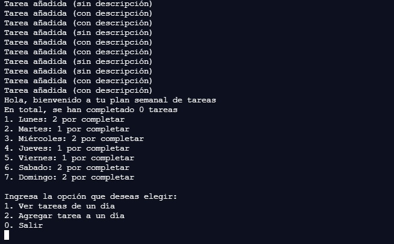
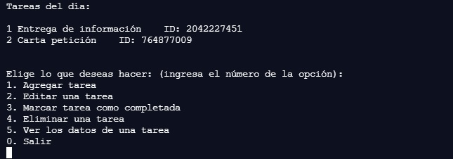
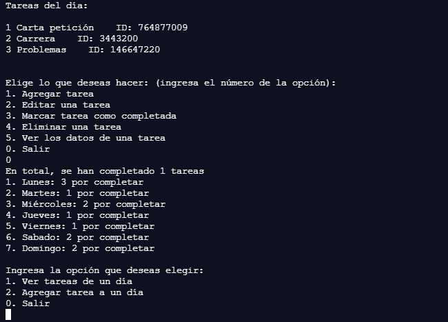

# TC1030_A01707035
Proyecto de Programación orientada a objetos - A01707035

En este repositorio se encuentran los diferentes recursos desarrollados a lo largo de la materia como parte de la evidencia de competencias. El proyecto tiene como objetivo principal el uso de programación orientada a objetos para crear un programa que permita manejar una calendario semanal agregando, eliminando y visualizando diferentes tipos de tareas.

### Corrida
Usando la línea de comandos es necesario primero posicionarse en la carpeta del proyecto para compilar y correr el código, para ello se puede utilizar el comando cd, un ejemplo sería:
```sh
	cd C:\Users\usr\Proyectos\TC1030_A01707035
```

Para compilar el proyecto correr lo siguiente:

```sh
	g++ misc.h tarea.h tareas_dia.h plan_semanal.h main.cpp -std=c++11
```

Y finalmente se corre el ejecutable de la siguiente manera (Windows):

```sh
	a.exe
```

### Uso del programa
Al correr el ejecutable en una terminal, lo primero que se verá será un menu similar al siguiente:


Este es el menu inicial, se ve una serié de lineas con "Tarea añadida", por la creación de tareas de ejemplo y posteriormente el menu que muestra las tareas completadas y pendientes en cada día. La interacción con estos menus es similar a lo largo del programa, ya que se ven una serie de acciones enumeradas, y se le pide al usuario ingresar el número de la acción que desea realizas, siendo 0 el "botón" de regreso o salida.

En este primer menu solo es posible ver los datos de una tarea, agregar una tarea directamente o salir y terminar el código, lo cuál se realiza ingresando el número de la opción y presionar ENTER. Al elegir una opción es posible que nos aparezca otra pregunta en la cuál ahora se deba ingresar el número del día en que se quiere ver o agregar tareas.

El menu que se ve al ingresar a las tareas de un día en especifico suele ser mas grande (a menos que no haya tareas por completar), se verá algo como esto:


Aquí, como ya se había mencionado, se puede utilizar el menu de la misma manera ingresando el número de la opción que se desea usar, las cuales permiten manejar la lista de tareas que se presentan, como por ejemplo, agregar, eliminar o editar tareas. Opciones que pueden desplegar una serie de preguntas para realizar dicha acción.

Una vez se haya terminado de realiza los cambios, se puede elegir la opción 0 (salir), para regresar al menu inicial y seguir editando tareas de otros dias:


### Posibles errores/problemas
La mayor cantidad de errores que se pueden presentar al correr el código desarrollado se encuentra en las secciones en que el usuario debe ingresar datos para agregar tareas. El código toma las medidas necesarias, utilizando condicionales, para que las opciones que se reciben como un número solo se encuentren en cierto rango de valores, sin embargo, se pueden presentar problemas cuando se intente ingresar un carácter en estos espacios que se espera un número. 

Por ejemplo, ingresando texto cuando se debe elegir un número de tarea:


O cuando se debe ingresar un número para la hora de un evento:


Además de esto, es posible que existan problemas al momento de desplegar caracteres especiales, como letras con acento o ñ, en diferentes lineas de comando/terminales. Este es un ejemplo con el Command Prompt en Windows:


### Decisiones de diseño

Como se puede identificar en el UML, no se cuenta con métodos de acceso (getters y setters) para todos los atributos de cada clase, lo cual es intencional y se utilza como medida de seguridad, ejemplos de esto son:

- En la clase Tarea, para el ID generado y el tipo no se cuenta con setters debido a que estos atributos se deben mantener constantes en cada uno, ya que son identificadores importante, y de los cuales no existe necesidad de que otros objetos modifiquen.
- En la clase Tareas_Dia no se cuenta con setters para el número de tareas totales y completadas, esto se debe a que el manejo de estos atributos se lleva a cabo únicamente por los métodos para eliminar tareas de la misma clase, por lo que no es necesario que otra clase modifique dichos valores, solo es necesario leerlos para desplegar la información.

