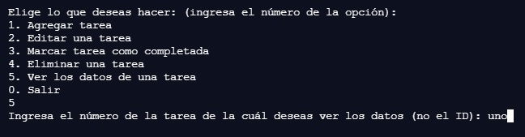
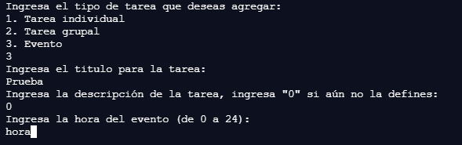
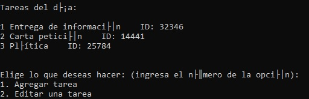

# TC1030_A01707035
Proyecto de Programación orientada a objetos - A01707035

En este repositorio se encuentran los diferentes recursos desarrollados a lo largo de la materia como parte de la evidencia de competencias. El proyecto tiene como objetivo principal el uso de programación orientada a objetos para crear un programa que permita manejar una calendario semanal agregando, eliminando y visualizando diferentes tipos de tareas.

### Corrida
Usando la línea de comandos es necesario primero posicionarse en la carpeta del proyecto para compilar y correr el código, para ello se puede utilizar el comando cd, un ejemplo sería:
```sh
	cd C:\Users\usr\Proyectos\TC1030_A01707035
```

Para compilar el proyecto correr lo siguiente:

```sh
	g++ misc.h tarea.h tareas_dia.h main.cpp -std=c++11
```

Y finalmente se corre el ejecutable de la siguiente manera (Windows):

```sh
	a.exe
```

### Posibles errores/problemas
La mayor cantidad de errores que se pueden presentar al correr el código desarrollado se encuentra en las secciones en que el usuario debe ingresar datos para agregar tareas. El código toma las medidas necesarias, utilizando condicionales, para que las opciones que se reciben como un número solo se encuentren en cierto rango de valores, sin embargo, se pueden presentar problemas cuando se intente ingresar un carácter en estos espacios que se espera un número. 

Por ejemplo, ingresando texto cuando se debe elegir un número de tarea:


O cuando se debe ingresar un número para la hora de un evento:


Además de esto, es posible que existan problemas al momento de desplegar caracteres especiales, como letras con acento o ñ, en diferentes lineas de comando/terminales. Este es un ejemplo con el Command Prompt en Windows:
